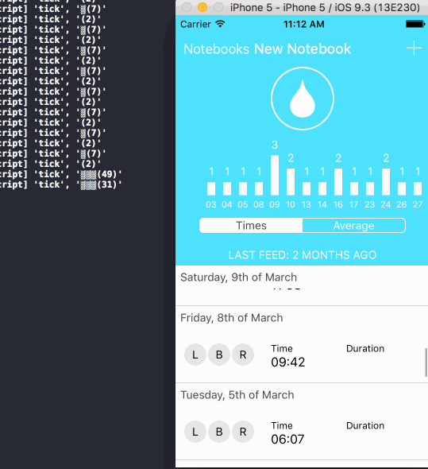

# React Native Snoopy

<h3 align="center">
  
  <br/>
  <br/>
</h3>
<br/>
<br/>


Snoopy is a profiling tool for React Native, that lets you snoop on the React Native Bridge. 

With Snoopy you can tame a stream of events, using
[Rx](https://github.com/Reactive-Extensions/RxJS) and a few built-in goodies,
to locate performance hogs, problems, and expose unexpected communications.


The React Native bridge is the hub where communication between the Javascript
and the Native world happen. Optimizing and catching unexpected (bad)
communications can make or break your performance. Being that central and
sensitive place, it made sense to have tooling built around it.

<h3 align="center">
  
  <br/>
  <br/>
</h3>


## Quick Start

```
$ npm install -S rn-snoopy
```

First, find a place to initialize Snoopy and the event stream, doesn't matter where, but
preferably under an `if(__DEV__)` guard.

```javascript
// core Snoopy
import Snoopy from 'rn-snoopy'

// some Snoopy goodies we're going to use
import bars from 'rn-snoopy/stream/bars'
import filter from 'rn-snoopy/stream/filter'
import buffer from 'rn-snoopy/stream/buffer'

// new RN
//import EventEmitter from 'react-native/Libraries/EventEmitter/EventEmitter'

// old RN
//import EventEmitter from 'react-native/Libraries/vendor/emitter/EventEmitter'

const emitter = new EventEmitter()

const events = Snoopy.stream(emitter)
```

In the following examples, we're going to use `info`, the call descriptor.

```javascript
{
  type: int (0=N->JS, 1=JS->N)
  method: string,
  module: string,
  args: object,
}
```


## Examples

Show only calls going from Javascript to Native create an `info` shape with
`Snoopy.TO_NATIVE`. Use `true` to log filter results.

```javascript
filter({ type: Snoopy.TO_NATIVE }, true)(events).subscribe()
```

Show calls to `createView`. Filter based on `method`, and provide a shape to match it.

```javascript
filter({ method:'createView' }, true)(events).subscribe()
```

Drill down and show only calls with specific arguments, using nested matching.

```javascript
filter({ method:'createView', {args: {foo: {bar:1}}}}, true)(events).subscribe()
```

Or use a function.

```javascript
filter((info)=>info.method == 'createView', true)(events).subscribe()
```

Visualize "excessive" calls across the bridge. Group and aggregate calls per second.

```javascript
bars()(
  buffer()(
    events
  )
).subscribe()
```


Visualize "heavy" calls across the bridge. Use a heuristic: serialize arguments and take
the size.

```javascript
bars(info=>JSON.stringify(info.args).length)(
  events
).subscribe()
```


Visualize "heavy" calls across the bridge. Set a threshold (`100`) and pop a Yellowbox (`true`) in Simulator
to warn about crossing the threshold.

```javascript
bars(infoAry=>infoAry.length, 100, true).length)(
  events
).subscribe()
```


Visualize "heavy" calls, only for view creation. This filters on `createView` and takes a look at the
argument data size.

```javascript
bars(info=>JSON.stringify(info.args).length)(
    filter({ method:'createView' })(events)
).subscribe()
```


# Contributing

Fork, implement, add tests, pull request, get my everlasting thanks and a respectable place here :).


### Thanks:

To all [Contributors](https://github.com/jondot/rn-snoopy/graphs/contributors) - you make this happen, thanks!


# Copyright

Copyright (c) 2016 [Dotan Nahum](http://gplus.to/dotan) [@jondot](http://twitter.com/jondot). See [LICENSE](LICENSE.txt) for further details.

